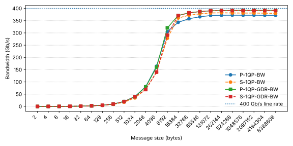
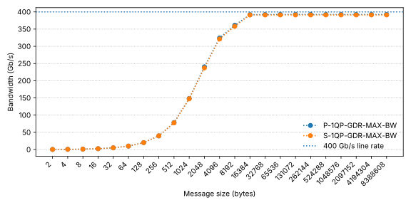

## TL; DR

If you're writing *synchronous* RDMA code in Rust and you're tired of:

- Hand-rolling FFI over `ibverbs-sys` / `rdma-core-sys`
- Fighting lifetimes over simple CQ / QP / MR ownership, and
- Rebuilding `rdma-core` just to link a tiny binary

Then [**sideway**](https://github.com/RDMA-Rust/sideway) gives you:

- Rust-flavored wrappers over modern ibverbs (`ibv_wr_*`, `ibv_start_poll`, Extended CQ / QP)
- A `dlopen` based static library so that you don't vendor rdma-core
- A basic but usable wrapper for `librdmacm`

Checkout our code at <https://github.com/RDMA-Rust/sideway>

This post is about *how* we built it, what trade-offs we made, and what we learned on the way.

## What do we get?

1. A Rust flavored wrapper for rdma-core (can saturate 400 Gbps RNIC)
2. Two bug fixes submitted to the rdma-core upstream
3. A "dummy" companion library for C/C++ programmer with `libibverbs` / `librdmacm` (rdma-core-mummy)
4. A lot of Rust + RDMA programming experience

## What's wrong with current wrappers?

Most current `libibverbs` and `librdmacm` Rust wrappers focus heavily on fancy language features (100% safe, async-first APIs, etc.), and less on being production-ready. They are great for exploration, and provide a lot of insights for our implementation, but awkward when you try to ship a serious RDMA application.

When you actually start coding, you often end up:

- Reaching for `ibverbs-sys` (or another bindgen-generated crate)
- Manually handling error-prone C macros / enum definitions
- Juggling C types and Rust types at the same time

On top of that, most crates assume you build and link the entire rdma-core project into your binary, or required you've install rdma-core on your compile machine. That pulls in unnecessary dependencies and build complexity.

We wanted something that:

- Keeps the control path ergonomic in Rust
- Keeps the data path as close as possible to raw `ibverbs` to achieve high performance
- Doesn't require vendoring rdma-core into every build

### How does sideway compare?

We are not claiming to replace other crates, different projects have different trade-offs. But for high performance, synchronous RDMA, there are some concrete issues you run into.

| Crate                                                   | Requires building rdma-core        | Wrapping librdmacm | Performance issues                                                                                                                                                                                                                                                                                                                                                                                                                                                                            |
|---------------------------------------------------------|------------------------------------|--------------------|-----------------------------------------------------------------------------------------------------------------------------------------------------------------------------------------------------------------------------------------------------------------------------------------------------------------------------------------------------------------------------------------------------------------------------------------------------------------------------------------------|
| [ibverbs](https://github.com/jonhoo/rust-ibverbs)       | Yes                                | No                 | 1. [Poll CQ at a constant batching size](https://github.com/jonhoo/rust-ibverbs/blob/3c1c57d1c3e1fa2dd00390174ac4bf70605e123f/ibverbs/src/lib.rs#L581)<br>2. [No batching WRs posting operation](https://github.com/jonhoo/rust-ibverbs/blob/3c1c57d1c3e1fa2dd00390174ac4bf70605e123f/ibverbs/src/lib.rs#L1904)<br>3. [Unable to specify send flags for moderation or fencing](https://github.com/jonhoo/rust-ibverbs/blob/3c1c57d1c3e1fa2dd00390174ac4bf70605e123f/ibverbs/src/lib.rs#L1908) |
| [rrddmma](https://github.com/IcicleF/rrddmma)           | Optional                           | No                 | Leave options to user                                                                                                                                                                                                                                                                                                                                                                                                                                                                         |
| [async-rdma](https://github.com/datenlord/async-rdma)   | No (But specific version required) | Yes                | 1. [No batching WRs posting operation](https://github.com/datenlord/async-rdma/blob/9480131f671eb97ded1ccfd5bb8d7bdc75be66fa/src/work_request.rs#L37)<br>2. [Unable to specify send flags for moderation for fencing](https://github.com/datenlord/async-rdma/blob/9480131f671eb97ded1ccfd5bb8d7bdc75be66fa/src/work_request.rs#L50)<br>3. [Create a CQ for every QP](https://github.com/datenlord/async-rdma/blob/9480131f671eb97ded1ccfd5bb8d7bdc75be66fa/src/lib.rs#L1278)                 |
| [rdma](https://github.com/Nugine/rdma)                  | No (But specific version required) | No                 | Leave options to user                                                                                                                                                                                                                                                                                                                                                                                                                                                                         |
| [rdma-rs](https://github.com/phoenix-dataplane/rdma-rs) | Yes                                | Yes                | 1. [No batching WRs posting operation](https://github.com/phoenix-dataplane/rdma-rs/blob/af8d2811cb01f9292a8648ac3a752245d3040da0/src/ibv.rs#L1397)<br>2. [Unable to specify send flags for moderation for fencing](https://github.com/phoenix-dataplane/rdma-rs/blob/af8d2811cb01f9292a8648ac3a752245d3040da0/src/ibv.rs#L1401)                                                                                                                                                              |
| [**Sideway**](https://github.com/RDMA-Rust/sideway)     | **No**                             | **Yes**            | Focused on modern verbs APIs (`ibv_wr_*`, CQ / QP Ex), zero-cost abstractions on the data path, and layered design                                                                                                                                                                                                                                                                                                                                                                            |

## Performance

To make sure our wrapper doesn't leave performance on the table, we vibe coded a [perftest](https://github.com/linux-rdma/perftest)-style benchmarking tool
called [stride](https://github.com/RDMA-Rust/stride). It's not meant to be a full replacement, just enough for validate that "Rust + sideway" can keep up
with the classic C tooling.

All experiments run on a Nebius GPU-H100-SXM instance with 8 * ConnectX-7 InfiniBand (IB) 400Gbps RDMA NIC

| Key                 | Value                                                   |
|---------------------|---------------------------------------------------------|
| Environment         | GPU-H100-SXM EU-NORTH1                                  |
| OS                  | Ubuntu 24.04.3 LTS (Noble Numbat) x86_64                |
| CPU                 | 2 × Intel(R) Xeon(R) Platinum 8468 (128) @ 2.10 GHz     |
| Kernel              | 6.11.0-1016-nvidia                                      |
| Memory              | 1.536 TiB                                               |
| RNIC                | ConnectX-7 InfiniBand 400 Gbps (firmware 28.39.3004)    |
| OFED                | DOCA 2.9.2                                              |
| GPU                 | NVIDIA H100 SXM5 80GB                                   |
| NVIDIA GPU Driver   | 570.195.03                                              |
| CUDA                | 12.8                                                    |
| Stride              | [87b3780](https://github.com/RDMA-Rust/stride/commit/87b37809af9b6518c23e11ee2f7615906f4dde9d) |
| Perftest            | [20e05b9](https://github.com/linux-rdma/perftest/commit/20e05b9b92c4694b8f59d882ab2a3b27f28c887f) |

We slighty modified stride's code to hardcode the LID in connection setup phase, to make it work with IB.
Apart from that, both tools use the same verbs settings.

### What we measure

We look at three basic scenarios, always with a single RC QP and message sizes from 2B to 8MiB:

1. **Single QP WRITE bandwidth (host / GPU memory)**
    - Host memory: `S-1QP-BW` (stride) vs `P-1QP-BW` (perftest)
    - GPU memory (GDR): `S-1QP-GDR-BW` vs `P-1QP-GDR-BW`

2. **Single QP "maxed out" WRITE bandwidth (GPU memory)**
    - GPU memory (GDR), Tx depth 4096, post list 64: `S-1QP-GDR-MAX-BW` vs `P-1QP-GDR-MAX-BW`
    - To better see small-message behavior, we also add message per second (MPS): `S-1QP-GDR-MAX-MPS` vs `P-1QP-GDR-MAX-MPS`

3. **Single QP WRITE latency (host / GPU memory)**
    - Host memory: `S-1QP-LAT` (stride) vs `P-1QP-LAT` (perftest)
    - GPU memory (GDR): `S-1QP-GDR-LAT` (perftest does not support WRITE latency with GPU buffers)
    - We also add P99 for jitter: `S-1QP-LAT-P99` vs `P-1QP-LAT-P99` vs `S-1QP-GDR-LAT-P99`

### Results at a glance

- **Bandwidth (host memory / GDR)**
  For a single QP, sideway/stride and perftest track each other closely across
  2B–8MiB. At large messages, both saturate the 400 Gb/s link:
  stride reaches ~380 Gb/s, and perftest is within a few percent of that.

=== "Line Table"
    

=== "Raw Data"
    |  Message Size | S-1QP-BW | P-1QP-BW | S-1QP-GDR-BW | P-1QP-GDR-BW |
    |---------------|----------|----------|--------------|--------------|
    |             2 |   0.0676 | 0.068664 |        0.077 |     0.075424 |
    |             4 |   0.1352 |     0.16 |       0.1546 |         0.15 |
    |             8 |    0.278 |     0.31 |       0.3098 |         0.31 |
    |            16 |   0.6217 |     0.63 |       0.6201 |         0.62 |
    |            32 |   1.2465 |     1.26 |       1.2379 |         1.24 |
    |            64 |   2.4941 |     2.51 |       2.4714 |         2.49 |
    |           128 |   4.3461 |     5.04 |       4.9527 |         4.97 |
    |           256 |   8.6742 |    10.12 |       9.9171 |         9.93 |
    |           512 |  17.3712 |    20.25 |      19.7997 |        19.77 |
    |          1024 |  34.7707 |    40.47 |      39.6772 |         39.8 |
    |          2048 |  69.6075 |    80.88 |      68.9667 |        79.51 |
    |          4096 | 139.2933 |   164.27 |     140.3711 |       160.21 |
    |          8192 | 278.4098 |    305.2 |     291.2193 |       320.74 |
    |         16384 | 360.9202 |   343.31 |     371.0165 |       371.11 |
    |         32768 | 372.1774 |   358.08 |     381.8385 |       382.28 |
    |         65536 | 377.9962 |   365.91 |     387.1709 |        387.1 |
    |        131072 | 381.4992 |   370.98 |      390.377 |       390.55 |
    |        262144 | 382.0199 |   372.04 |     391.1473 |       391.67 |
    |        524288 |  381.505 |   372.35 |     391.1888 |        391.9 |
    |       1048576 | 381.2342 |   372.09 |     391.1909 |       392.25 |
    |       2097152 |  381.307 |   372.12 |     391.1919 |       392.39 |
    |       4194304 | 380.6771 |   371.92 |     391.1924 |       392.44 |
    |       8388608 | 379.7436 |   371.82 |     391.1926 |       392.44 |

=== "Command"
    ```bash
    # Perftest server
    taskset -c 66 ib_write_bw -d mlx5_0 -n 100000 -a -Q 1
    # Perftest client
    taskset -c 68 ib_write_bw -d mlx5_1 -n 100000 -a 127.0.0.1 -Q 1
    # Perftest server (GDR)
    taskset -c 66 ib_write_bw -d mlx5_0 -n 100000 -a -Q 1 --use_cuda 4
    # Perftest client (GDR)
    taskset -c 68 ib_write_bw -d mlx5_1 -n 100000 -a 127.0.0.1 -Q 1 --use_cuda 5

    # Stride server
    taskset -c 66 stride-perf write bw -d mlx5_0 -n 100000 -a --max-msg-size $((8*1024*1024))
    # Stride client
    taskset -c 68 stride-perf write bw -d mlx5_1 127.0.0.1 -n 1000000 -a --max-msg-size $((8*1024*1024))
    # Stride server (GDR)
    taskset -c 66 stride-perf write bw -d mlx5_0 -n 100000 -a --max-msg-size $((8*1024*1024)) --use-cuda 4
    # Stride client (GDR)
    taskset -c 68 stride-perf write bw -d mlx5_1 127.0.0.1 -n 1000000 -a --max-msg-size $((8*1024*1024)) --use-cuda 5
    ```

- **Bandwidth (GDR, maxed out)**
  With a larger `tx_depth` and `post_list`, a single QP hits ~392.5 Gbit/s — essentially
  line-rate for a 400 Gbit/s port. For small messages, throughput reaches ~20 Mpps.

=== "Line Table"
    

=== "Raw Data"
    | Message Size | S-1QP-GDR-MAX-BW | S-1QP-GDR-MAX-MPS | P-1QP-GDR-MAX-BW | P-1QP-GDR-MAX-MPS |
    |--------------|------------------|-------------------|------------------|-------------------|
    |            2 |           0.3153 |           19.7076 |             0.32 |         19.855156 |
    |            4 |            0.632 |           19.7505 |             0.64 |         19.890087 |
    |            8 |           1.2636 |           19.7432 |             1.28 |          19.92576 |
    |           16 |           2.5247 |           19.7239 |             2.54 |         19.851894 |
    |           32 |           5.0515 |           19.7323 |             5.07 |         19.800955 |
    |           64 |          10.0584 |           19.6453 |            10.11 |         19.740872 |
    |          128 |           20.068 |           19.5976 |            20.13 |         19.659211 |
    |          256 |          39.8753 |           19.4703 |            39.73 |         19.400613 |
    |          512 |          77.5093 |           18.9232 |            78.32 |         19.121788 |
    |         1024 |         147.5344 |           18.0096 |           148.25 |         18.096757 |
    |         2048 |         237.1809 |           14.4764 |            240.4 |         14.672663 |
    |         4096 |          321.151 |            9.8007 |           324.23 |          9.894732 |
    |         8192 |         358.1028 |            5.4642 |           361.24 |          5.512146 |
    |        16384 |         391.0239 |            2.9833 |           391.81 |          2.989263 |
    |        32768 |         391.1139 |             1.492 |           392.17 |          1.495991 |
    |        65536 |         391.1547 |            0.7461 |           392.51 |           0.74865 |
    |       131072 |         391.1747 |            0.3731 |           392.63 |          0.374441 |
    |       262144 |         391.1837 |            0.1865 |            392.6 |          0.187209 |
    |       524288 |         391.1888 |            0.0933 |            392.5 |          0.093579 |
    |      1048576 |         391.1903 |            0.0466 |           392.46 |          0.046785 |
    |      2097152 |         391.1912 |            0.0233 |           392.43 |          0.023391 |
    |      4194304 |         391.1923 |            0.0117 |           392.44 |          0.011696 |
    |      8388608 |         391.1925 |            0.0058 |           392.44 |          0.005848 |

=== "Command"
    ```bash
    # Perftest server
    taskset -c 66 ib_write_bw -d mlx5_0 -n 102400 -a -Q 1 --report_gbits --use_cuda 4 -l 64 -t 4096
    # Perftest client
    taskset -c 68 ib_write_bw -d mlx5_1 -n 102400 -a 127.0.0.1 -Q 1 --report_gbits --use_cuda 5 -l 64 -t 4096

    # Stride server
    taskset -c 66 stride-perf write bw -d mlx5_0 -n 102400 -a --max-msg-size $((8*1024*1024)) --use-cuda 4 -l 64 -t 4096
    # Stride client
    taskset -c 68 stride-perf write bw -d mlx5_1 -n 102400 -a --max-msg-size $((8*1024*1024)) 127.0.0.1 --use-cuda 5 -l 64 -t 4096
    ```

- **Latency**
  For small messages in host memory, perftest’s numbers look better at first glance — but that’s because we measure slightly different things:

    - perftest’s WRITE latency is effectively **half** of a round-trip: client WRITE → server DMA starts → server DMA ends (single-trip data + DMA time).
    - stride’s WRITE latency measures **data transfer + ACK** (client WRITE → server NIC ACK → client CQE).

  GPU WRITE latency with stride is slightly higher but still scales cleanly with message size.

=== "Line Table"
    

=== "Raw Data"
    |  Message Size | P-1QP-LAT | P-1QP-LAT-P99 | S-1QP-LAT | S-1QP-LAT-P99 | S-1QP-GDR-LAT | S-1QP-GDR-LAT-P99 |
    |---------------|-----------|---------------|-----------|---------------|---------------|-------------------|
    |             2 |      3.38 |          3.47 |     5.286 |         5.487 |         5.412 |             5.487 |
    |             4 |      3.38 |          3.46 |     5.322 |         5.495 |         5.411 |             5.479 |
    |             8 |      3.38 |          3.47 |     5.334 |         5.495 |          5.42 |             5.483 |
    |            16 |      3.39 |          3.47 |     5.336 |         5.495 |         5.418 |             5.487 |
    |            32 |       3.4 |          3.51 |     5.329 |         5.495 |         5.415 |             5.483 |
    |            64 |       3.4 |          3.48 |     5.351 |         5.495 |         5.432 |             5.499 |
    |           128 |      3.46 |          3.57 |     5.371 |         5.543 |          5.45 |             5.511 |
    |           256 |      3.51 |          3.62 |     5.421 |         5.575 |         5.473 |             5.539 |
    |           512 |      3.57 |          3.71 |      5.48 |         5.619 |         5.486 |             5.555 |
    |          1024 |      3.61 |          3.78 |      5.53 |         5.683 |         5.523 |             5.595 |
    |          2048 |      3.75 |          4.19 |     5.634 |         5.743 |         5.583 |             5.647 |
    |          4096 |      3.93 |          4.49 |     5.785 |         5.895 |         5.692 |             5.767 |
    |          8192 |      4.13 |          4.75 |     5.947 |         6.163 |         5.887 |             6.027 |
    |         16384 |      4.53 |          5.23 |     6.357 |         6.499 |         6.242 |             6.315 |
    |         32768 |      5.07 |          5.61 |     6.968 |         7.087 |         6.724 |             6.803 |
    |         65536 |      6.11 |          6.84 |      7.91 |         8.063 |          7.66 |             7.751 |
    |        131072 |      9.53 |           9.9 |    10.644 |        10.807 |         10.12 |            10.207 |
    |        262144 |     14.66 |         15.98 |    14.999 |        15.239 |         13.86 |            13.967 |
    |        524288 |     20.12 |         21.64 |    20.692 |        21.599 |         19.25 |            19.359 |
    |       1048576 |     30.93 |         33.13 |    31.571 |        33.567 |        29.983 |            30.079 |
    |       2097152 |      53.5 |         56.62 |    53.569 |        57.503 |        51.442 |            51.551 |
    |       4194304 |        99 |        103.14 |    97.649 |       104.575 |        94.327 |            94.463 |
    |       8388608 |    189.92 |        194.66 |   186.243 |       196.351 |       180.107 |           180.223 |

=== "Command"
    ```bash
    # Perftest server
    taskset -c 66 ib_write_lat -d mlx5_0 -n 100000 -a -I 0
    # Perftest client
    taskset -c 68 ib_write_lat -d mlx5_1 -n 100000 -a 127.0.0.1 -I 0

    # Stride server
    taskset -c 66 stride-perf write lat -d mlx5_0 -n 100000 -a --max-msg-size $((8*1024*1024))
    # Stride client
    taskset -c 68 stride-perf write lat -d mlx5_1 -n 100000 -a --max-msg-size $((8*1024*1024)) 127.0.0.1

    # Stride server (GDR)
    taskset -c 66 stride-perf write lat -d mlx5_0 -n 100000 -a --max-msg-size $((8*1024*1024)) --use-cuda 4
    # Stride client (GDR)
    taskset -c 68 stride-perf write lat -d mlx5_1 -n 100000 -a --max-msg-size $((8*1024*1024)) 127.0.0.1 --use-cuda 5
    ```

## Design: layered abstraction

We treat RDMA abstraction as a layered problem:

```d2 scale="0.7"
rdma-core -> rdma-core-mummy: dlopen

rdma-core-mummy -> rdma-mummy-sys: bindgen + manual binding

rdma-mummy-sys -> sideway: Rust flavored wrapper

sideway -> trespass: socket-like communication library

trespass -> Your RPC / storage / inference service
```

### `rdma-mummy-sys` -- the raw rdma-core API wrapper

The first layer is a bindgen-generated + manually corrected library on top of rdma-core (actually `rdma-core-mummy`, more on that in the `dlopen` section), This is:

- The base for all upper layers
- Available for users who want direct access to the C APIs with minimal sugar

### `Sideway` -- the Rust flavor wrapper over rdma-core

The second layer is sideway, a Rust-flavored rdma-core wrapper. It:

- Re-encapsulates C macros and anonymous enums as Rust enums
- Uses the builder pattern to make APIs more ergonomic
- Encapsulates an iterator-style CQ polling API
The iterator style is faster than `ibv_poll_cq` in some projects, and exposes more information: for example, it lets you directly obtain hardware timestamps from CQEs.

We deliberately **do not** make everything safe:

- Wrappers for `ibv_reg_mr` and `ibv_post_send` / `ibv_wr_*` remain `unsafe`
- Trying to fully encode their safety in this layer would either:
    - Hurt performance
    - Over-constrain upper layers that need to do unusual things (e.g., GDR with GPU memory)

Instead, the idea is:

- Sideway gives you a clear, zero-cost mapping to modern verbs
- Upper layers (like `trespass` or your own library) can build safe memory pools or connection abstractions on top

For user experience, we also provide a unified interface over CQ / CQ Ex and QP / QP Ex.
If you've written RDMA before, you must know `ibv_post_send` and `ibv_poll_cq`, but you may not have used `ibv_wr_*` and `ibv_start_poll`, these newer APIs are more efficient and expose features like hardware timestamps from work completions. Sideway lets you start with the "classic" style and move to the extended APIs with minimal changes.

Let's compare the traditional `ibv_post_send`, and `ibv_wr_*`, and our sideway
<div class="grid" markdown>

=== "ibv_post_send"
    ```C
    struct ibv_send_wr wr;

    struct ibv_sge sge = {
        .addr = local_addr,
        .length = 4096,
        .lkey = lkey,
    };

    wr.wr_id = 233;
    wr.next = NULL;
    wr.sg_list = &sge;
    wr.num_sge = 1;
    wr.opcode = IBV_WR_RDMA_WRITE;
    wr.send_flags = IBV_SEND_SIGNALED;
    wr.wr.rdma.remote_addr = remote_addr;
    wr.wr.rdma.rkey = rkey;

    // Before actual post, you could construct more WRs use `next` to chain them,
    // which could increase performance
    int ret = ibv_post_send(qp, &wr, NULL);
    ```

=== "ibv_wr_*"
    ```C
    ibv_wr_start(qp);

    qp->wr_id = 233;
    qp->wr_flags = IBV_SEND_SIGNALED;
    ibv_wr_rdma_write(qp, rkey, remote_addr);

    ibv_wr_set_sge(qp, lkey, local_addr, 4096);

    // Before actual post, you could construct more WRs and then post them at once,
    // which could increase performance
    ibv_wr_complete(qp);
    ```

```Rust title="sideway"
let mut guard = qp.start_post_send();

let write_handle = guard
    .construct_wr(233, WorkRequestFlags::Signaled)
    .setup_write(rmr.rkey(), rmr.get_ptr() as _);

write_handle.setup_sge(lmr.lkey(), lmr.get_ptr() as _, 4096);

// Before actual post, you could construct more WRs and then post them at once,
// which could increase performance
guard.post()?;
```

</div>

How about `ibv_poll_cq` vs `ibv_start_poll` vs sideway?

Although `ibv_poll_cq` looks cleaner, it doesn't support hardware timestamps and costs more cycles,
because it has to copy from CQ to work completions.

<div class="grid" markdown>

=== "ibv_poll_cq"
    ```C
    struct ibv_wc wc;

    while (ibv_poll_cq(cq, 1, &wc) > 0) {
        printf("wr_id: %lu, status: %u, opcode: %u\n", wc.wr_id, wc.status, wc.opcode);
    }
    ```

=== "ibv_start_poll"
    ```C
    int ret = ibv_start_poll(cq, &attr);
    // assume the first ret is not ENOENT
    while (ret != ENOENT) {
        printf("wr_id: %lu, status: %u, opcode: %u\n", cq->wr_id, cq->status, ibv_wc_read_opcode(cq));
        ret = ibv_next_poll(cq);
    }
    ibv_end_poll(cq);
    ```

```Rust title="sideway"
match cq.start_poll() {
    Ok(mut poller) => {
        while let Some(wc) = poller.next() {
            println!("wr_id: {}, status: {}, opcode: {}", wc.wr_id(), wc.status(), wc.opcode())
        }
    }
    Err(_) => {
        continue;
    }
}
```

</div>

We also invest in **better error reporting** on the RDMA control path. Instead of a mysterious `-EINVAL` from the kernel on `modify_qp`, we:

- Tell you what attribute is invalid
- Surface specific error-based errors (like `ETIMEDOUT`) as typed Rust errors, making it easier to debug and monitor control-plane behavior

??? "Example on invalid attributes"
    ```diff
    diff --git a/examples/rc_pingpong_split.rs b/examples/rc_pingpong_split.rs
    index c0d53ed..2d9c61c 100644
    --- a/examples/rc_pingpong_split.rs
    +++ b/examples/rc_pingpong_split.rs
    @@ -250,8 +250,7 @@ impl PingPongContext {
                .setup_path_mtu(mtu)
                .setup_dest_qp_num(remote_context.qp_number)
                .setup_rq_psn(psn)
    -            .setup_max_dest_read_atomic(0)
    -            .setup_min_rnr_timer(0);
    +            .setup_port(ib_port);

            // setup address vector
            let mut ah_attr = AddressHandleAttribute::new();
    ```

    ```bash hl_lines="10"
    $ cargo run --example rc_pingpong_split -- -d rxe_0 -g 1 -n 1 &

    $ cargo run --example rc_pingpong_split -- -d rxe_0 -g 1 -n 1 127.0.0.1
        Finished `dev` profile [unoptimized + debuginfo] target(s) in 0.09s
        Running `target/debug/examples/rc_pingpong_split -d rxe_0 -g 1 -n 1 127.0.0.1`
    local address: QPN 0x007a, PSN 0xcf45d8, GID 0000:0000:0000:0000:0000:ffff:ac1e:0818
    remote address: QPN 0x0079, PSN 0x3f2d77, GID 0000:0000:0000:0000:0000:ffff:ac1e:0818

    thread 'main' panicked at examples/rc_pingpong_split.rs:266:31:
    Failed to modify QP to RTR: ModifyQueuePairError(InvalidAttributeMask { cur_state: Init, next_state: ReadyToReceive, invalid: QueuePairAttributeMask[Port], needed: QueuePairAttributeMask[MinResponderNotReadyTimer, MaxDestinationReadAtomic], source: Os { code: 22, kind: InvalidInput, message: "Invalid argument" } })
    note: run with `RUST_BACKTRACE=1` environment variable to display a backtrace
    ```

    The kernel only tells you `EINVAL`. sideway tells you that you need to set `MinResponderNotReadyTimer` and `MaxDestinationReadAtomic`, and you **shouldn't** set
    `Port` in this transition. It's much easier to fix the code when you have that context.

??? "Example on invalid GID / Addr"

    ```bash hl_lines="10"
    $ cargo run --example rc_pingpong_split -- -d mlx_0 -g 0 -n 1 &

    $ cargo run --example rc_pingpong_split -- -d rxe_0 -g 0 -n 1 127.0.0.1
    Finished `dev` profile [unoptimized + debuginfo] target(s) in 0.09s
    Running `target/debug/examples/rc_pingpong_split -d rxe_0 -g 0 -n 1 127.0.0.1`
     local address: QPN 0x007d, PSN 0xcd1e89, GID fe80:0000:0000:0000:5054:00ff:fe36:7656
    remote address: QPN 0x014b, PSN 0xa0dc7d, GID fe80:0000:0000:0000:fc6b:02ff:fea7:d4bf

    thread 'main' panicked at examples/rc_pingpong_split.rs:267:31:
    Failed to modify QP to RTR: ModifyQueuePairError(ResolveRouteTimedout { sgid_index: 0, gid: Gid { raw: [254, 128, 0, 0, 0, 0, 0, 0, 252, 107, 2, 255, 254, 167, 212, 191] }, source: Os { code: 110, kind: TimedOut, message: "Connection timed out" } })
    note: run with `RUST_BACKTRACE=1` environment variable to display a backtrace
    ```

    The result gives us a hint with `sgid_index` and `gid`, let's look them up with `show_gids`

    ```bash hl_lines="6 8"
    $ cargo run --example show_gids
    Finished `dev` profile [unoptimized + debuginfo] target(s) in 0.09s
     Running `target/debug/examples/show_gids`
      Dev   | Port | Index |                   GID                   |    IPv4     |  Ver   | Netdev
    --------+------+-------+-----------------------------------------+-------------+--------+---------
    mlx5_0 |  1   |   0   | fe80:0000:0000:0000:fc6b:02ff:fea7:d4bf |             | RoCEv1 | enp8s0
    mlx5_0 |  1   |   1   | fe80:0000:0000:0000:fc6b:02ff:fea7:d4bf |             | RoCEv2 | enp8s0
    rxe_0  |  1   |   0   | fe80:0000:0000:0000:5054:00ff:fe36:7656 |             | RoCEv2 | enp6s0
    ```

    Looks like we're using a link local address for connection setup! That's why it didn't make it. We should set up a global scope IPv6 or IPv4 address with correct routes to make it work.
    Without a hint of GID index and GID, it takes experience and time to figure out where that `ETIMEDOUT` came from.

### `Trepass` -- the communication library (WIP)

The third layer is `trespass`, a communication library that offers a socket-like interface over RDMA, you can think of it as

- In the same space as UCX / `libfabric`
- But intentionally much simpler and focused
Its goals:
- Hide RDMA details such as
    - Which operations consume recv WQEs
    - How to do flow control
    - How to exchange MR information and other connection information
    - How to do batching for best performance
- Let users reuse existing socket programming experience (C / C++ / Rust) to get started quickly.

### RPC library?

The top layer, an RPC framework using RDMA as transport, is intentionally **out of scope** for us for now. Different applications have very different requirements:

- Long running storage systems
- RPC-heavy microservices
- ML inference services

Our goal is to provide solid building blocks (rdma-mummy-sys, sideway, trespass) that such frameworks can use.

### Where is async?

You may wonder: *where is async?* This is Rust, after all.

Our view:

- RDMA itself is asynchronous
- Its control path is not usually performance critical
- Directly integrating verbs with today’s general-purpose async runtimes (especially Tokio) is not straightforward

We think a **thread-per-core** style runtime is more promising for high-performance RDMA, and sideway is designed so that such a runtime can be built on top

- Run a dedicated RDMA worker thread per core
- Communicate with the rest of the system via channels
- Keep verbs usage straightforward and predictable.

We may explore this more in the future, but sideway itself is synchronous by design.

## The magic of `dlopen`

For some historical reasons, `libibverbs` and some of the providers uses an annoying private symbol mechanism <https://github.com/linux-rdma/rdma-core/blob/master/Documentation/versioning.md>

The idea is to ensure that distributed binaries link against the exact rdma-core version they were built with. While this is understandable, it makes it hard to distribute a single binary across different environments, even when you don’t actually use the private functions.

To solve this, we provide a static library called **rdma-core-mummy** which:

- Uses `dlopen` to load `libibverbs` and `librdmacm` at runtime (these two are what you usually need in DCN)
- So your application only links against our static library instead of all of rdma-core.

You might ask: *why not just use `libloading` in Rust?*

Because we also want other C/C++ developers to benefit from this approach.

## Lifetime or not, that's a question

RDMA resources depend on each other


/// caption
RDMA resources dependency (from [Nugine](https://github.com/Nugine/rdma))
///

At first glance, lifetimes seem like the natural Rust solution:

- Express resource relationships in the type system
- Catch misuse at compile time

We tried that (versions before v0.4.0).

When we encapsulated CQ, QP and MR in a `WorkerContext` (a common C/C++ pattern), lifetime annotations quickly turned into a pain:

- The types became complex and fragile
- We had to use patterns like `ouroboros` to silence the borrow checker
- Things that are obviously safe conceptually still made the compiler shout at us
The moment where "safety" stops helping and starts blocking reasonable designs is the moment we decided we were going too far.

So we chose a simpler model: **`Arc` for most resources**.

- Users don't have to think about lifetimes
- Resources are still dropped in a correct order
- The overhead of refcounting doesn't show up on the data path
You can see this in `stride`

Before `Arc`: <https://github.com/RDMA-Rust/stride/commit/c5a6a0c83973bd187f1f4ac57a07942d8d278e23>

After `Arc`: <https://github.com/RDMA-Rust/stride/commit/fd30aeb4b5b5fa27ee89d1877670058021d670e3>

<div class="grid" markdown>

```Rust title="Before `Arc`"
pub struct WorkerContext<'a> {
    pub queue_pairs: Vec<GenericQueuePair<'a>>,
    pub send_completion_queue: Rc<RefCell<ExtendedCompletionQueue<'a>>>,
    pub recv_completion_queue: Option<Rc<RefCell<ExtendedCompletionQueue<'a>>>>,
    ...
}

```

```Rust title="After `Arc`"
pub struct WorkerContext {
    pub queue_pairs: Vec<GenericQueuePair>,
    pub send_completion_queue: GenericCompletionQueue,
    pub recv_completion_queue: Option<GenericCompletionQueue>,
    ...
}
```

</div>

Much more readable, and closer to how RDMA is actually used in real systems.

## Rust's unittest framework & patches for upstream

To keep sideway healthy, we rely heavily on Rust’s built-in test framework:

- Unit tests that can run with or without an RDMA NIC present,
- CI that exercises SoftRoCE where available.
During this process, we found **two bugs in rdma-core and upstreamed fixes**

### SoftRoCE (RXE) CQ bug

When we try to port `ibv_rc_pingpong` to sideway, it ran fine on Mellanox NICs but behaved strangely on SoftRoCE: we kept polling CQEs with `wr_id` 0.

At first, we thought maybe there is something wrong with our implementation, so we tried to use `bpftrace` to catch what's happening in the kernel

??? note "bpftrace script for debugging"

    ```bpftrace title="rxe_qp_tracer.bt"
    #include <rdma/ib_verbs.h>

    struct rxe_pool_elem {
            void            *pool;
            void                    *obj;
            struct kref             ref_cnt;
            struct list_head        list;
            struct completion       complete;
            u32                     index;
    };

    enum queue_type {
            QUEUE_TYPE_TO_CLIENT,
            QUEUE_TYPE_FROM_CLIENT,
            QUEUE_TYPE_FROM_ULP,
            QUEUE_TYPE_TO_ULP,
    };

    struct rxe_queue {
            void            *rxe;
            void    *buf;
            void    *ip;
            size_t                  buf_size;
            size_t                  elem_size;
            unsigned int            log2_elem_size;
            u32                     index_mask;
            enum queue_type         type;
            /* private copy of index for shared queues between
            * driver and clients. Driver reads and writes
            * this copy and then replicates to rxe_queue_buf
            * for read access by clients.
            */
            u32                     index;
    };

    struct rxe_sq {
            int                     max_wr;
            int                     max_sge;
            int                     max_inline;
            spinlock_t              sq_lock; /* guard queue */
            struct rxe_queue        *queue;
    };

    struct rxe_rq {
            int                     max_wr;
            int                     max_sge;
            spinlock_t              producer_lock; /* guard queue producer */
            spinlock_t              consumer_lock; /* guard queue consumer */
            struct rxe_queue        *queue;
    };

    struct rxe_qp {
            struct ib_qp ibqp;
            struct rxe_pool_elem elem;
            struct ib_qp_attr attr;
            unsigned int valid;
            unsigned int            mtu;
            bool                    is_user;
            void            *pd;
            void            *srq;
            void      *scq;
            void            *rcq;
            enum ib_sig_type        sq_sig_type;
            struct rxe_sq           sq;
            struct rxe_rq           rq;
    };

    kprobe:rxe_completer,kprobe:rxe_requester {
      $qp = (struct rxe_qp *)arg0;
            printf("%s: valid: %u, state: %u\n", func, $qp->valid, $qp->attr.qp_state);
            printf("%s: max_wr: %u, max_sge: %u, index: %u\n", func, $qp->sq.max_wr, $qp->sq.max_sge, $qp->sq.queue->index);
    }

    kretprobe:rxe_completer,kretprobe:rxe_requester {
            printf("%s: return: %d\n", func, retval);
    }

    kretprobe:rxe_xmit_packet {
            printf("%s: return %d\n", func, retval);
    }
    ```

With command below

```bash
cargo run --example rc_pingpong_split -- -d rxe_0 -g 1 -n 1 &

cargo run --example rc_pingpong_split -- -d rxe_0 -g 1 127.0.0.1 -n 1
```

Bpftrace gave us this

```bash
$ sudo bpftrace ./rxe_qp_tracer.bt
Attaching 5 probes...
rxe_requester: valid: 0, state: 3
rxe_requester: max_wr: 1, max_sge: 8, index: 1
rxe_requester: return: -11
rxe_completer: valid: 0, state: 3
rxe_completer: max_wr: 1, max_sge: 8, index: 1
rxe_completer: return: -11
rxe_requester: valid: 1, state: 3
rxe_requester: max_wr: 1, max_sge: 8, index: 0
rxe_xmit_packet: return 0
rxe_requester: return: 0
...
rxe_completer: valid: 0, state: 6
rxe_completer: max_wr: 1, max_sge: 8, index: 1
rxe_completer: return: -11
^C
```

Which means the `rxe_completer` only ran finite rounds, and the kernel reported correct number of completions. So we turned to user space driver, after carefully debugging and code review, we finally found the reason and fixed it:

[rxe: fix completion queue consumer index overrun #1512](https://github.com/linux-rdma/rdma-core/pull/1512)

Then we add it to the CI: [E2E rc_pingpong test](https://github.com/RDMA-Rust/sideway/blob/5311a8e5a4bfbfd3530c085040a19009cdf927d6/.cirrus.yml#L29)

### Device detection issue

Another bug appeared after a reboot: one of our tests started to fail. The only difference? SoftRoCE wasn't set up yet.
We realized that the machine still had Mellanox VFs, so the test *should* have passed. But the rdma-core's logic around devices and rdmacm didn't behave as expected.

That turned into: [librdmacm: prevent NULL pointer access during device initialization](https://github.com/linux-rdma/rdma-core/pull/1547)

Corresponding unit test: [rdmacm::communication_manager::tests::test_cm_id_reference_count](https://github.com/RDMA-Rust/sideway/blob/5311a8e5a4bfbfd3530c085040a19009cdf927d6/src/rdmacm/communication_manager.rs#L1013)

## Examples

If you want to see what real code looks like, check out the examples:

[https://github.com/RDMA-Rust/sideway/tree/main/examples](https://github.com/RDMA-Rust/sideway/tree/main/examples)

There are small programs for

- [Basic RC ping-pong](https://github.com/RDMA-Rust/sideway/blob/main/examples/rc_pingpong.rs)
- [Show GIDs](https://github.com/RDMA-Rust/sideway/blob/main/examples/show_gids.rs)
- [Get device info](https://github.com/RDMA-Rust/sideway/blob/main/examples/ibv_devinfo.rs)
- [Check connection setup time with RDMACM](https://github.com/RDMA-Rust/sideway/blob/main/examples/cmtime.rs)

We dogfood sideway through these examples and through `stride`.

## Production status & Roadmap

- Status: **v0.Y.Z**, the API may still change, but the overall design is fairly stable
- We are trying to use sideway to build more tools (for example, stride), and adjusting the APIs as we discover better patterns
- We've tested our APIs on Mellanox CX-5, CX-6, BF3 mini and SoftRoCE, other RNICs haven't be tested yet.
- Near-term:
    - Provide UD, UC support
    - Provide CQ Event support
    - Provide Atomic FAA / CAS support
    - Provide thread domain support
    - Plugin system for working with direct verbs
    - More tests, docs, and bug fixes
- Long-term:
    - Complete the trespass communication library
    - Explore a "thread-per-core" async runtime on top of sideway

Let's make Rust network fast with RDMA!
